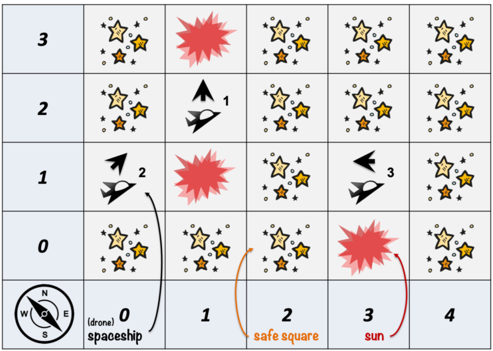

### Project Overview

This project is to develop a star search simulation system for space exploration. The simulation uses small drones, which are semi-autonomous spacecraft, to explore remote areas of space. Drones can occasionally receive commands directly from human controllers. However, they generally conduct exploration activities using only their own internal capabilities. The system is able to read in a file which describes the specific scenario, including the characteristics of the space region to be explored, the capabilities of the drones, and other details about the simulation run. 

### System Design

**Deliverables**: [Class Diagram](https://github.com/shuang379/star_search_simulation_system/blob/main/class_diagram.png), [Sequence Diagram](https://github.com/shuang379/star_search_simulation_system/blob/main/sequence_diagram.png)

The simulation system monitors the actions of a group of drones as they chart the given space region and tracks the states of all associated objects in the simulation. The specifications for each object are as follows:

**The Space Region**: The space region is modeled as a two-dimensional rectangular grid and further divided into uniform-sized squares, while each square contains a small "star field" unless it contains an obstacle or other artifact. The only obstacles are the suns which cause the drone to be vaporized instantly. 

**The Drones**: Drones work as a team and coordinate their actions to explore as much of the space as possible. Drones can execute one of four actions: steer, thrust (1-3 steps forward), scan and pass. 

**The Simulation Run**: The simulation is conducted as a discrete-event run. The state of the simulation changes over multiple, well-defined turns. A turn is defined as the opportunity for each drone to execute one single action. If a drone attempts to visit or pass through a sun, it is instantly vaporized and removed from the space. One simulation run starts from reading in a scenario file and ends when all safe squares have been explored or all drones have been removed or the maximum number of turns have been reached. 

**Other Docs**: [Use Case Diagram](https://github.com/shuang379/star_search_simulation_system/blob/main/use_case_diagram.png), [Deployment Diagram](https://github.com/shuang379/star_search_simulation_system/blob/main/deployment_diagram.png)

**Reference**: CS6300 class documentation @ Georgia Institute of Technology